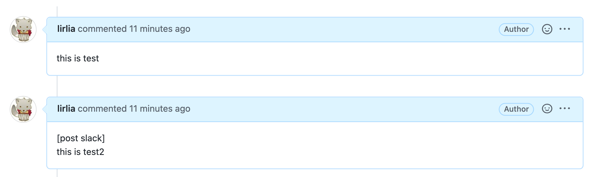
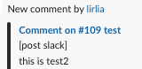

# GitHub Comment Notifier to Slack (GitHub Actions)

[英語(Eng)](./README.md) | [日本語(JP)](./README_jp.md)

このリポジトリは、**Pull Request への GitHub コメントを Slack 形式に変換して、Slack に通知する GitHub Action** を公開します。

## できること

現在 GitHub から Slack の通知には、フィルタや条件付けを行うことが出来ません。そのため CI の通知や、bot のコメントなどが大量に含まれるリポジトリでは GitHub と Slack の通知連携が非常にうるさいです。

この GitHub Action を利用した CI を設定することで、特定の条件に引っかかった(もしくは特定の条件にマッチしない)コメントのみを Slack に通知することができます。


### 例

例えば以下は [post slack] という文字列が GitHub コメントに存在するときのみ通知する例です。

このような Yaml を定義します。これは PR Request のコメントとレビューコメントが作成されたタイミングで動作する GitHub Action で、`[post slack]` という文言が含まれるコメントのみを Slack に投稿します。

```yaml
name: github-comment-to-slack

on:
  issue_comment:
    types:
      - created
  pull_request_review_comment:
    types:
      - created
jobs:
  github-comment-to-slack:
    name: GitHub comment to slack
    if: ${{ startsWith(github.event.comment.body, '[post slack]') }}
    runs-on: ubuntu-latest
    steps:
      - uses: lirlia/github-comment-notifier-to-slack@v1.0.0
        with:
          slack-webhook-url: ${{ secrets.MY_WEBHOOK_URL }}
```

上記の設定をしているので、このようなコメントを行っても test2 のコメントのみ投稿されます。




## 使用方法

```yaml
- uses: lirlia/github-comment-notifier-to-slack@v1.0.0
  with:
    # slack webhook url (recommend to use GitHub secret)
    # https://docs.github.com/ja/actions/security-guides/encrypted-secrets
    slack-webhook-url: ${{ secrets.MY_WEBHOOK_URL }}
    # color code (HEX) for slack attachment 
    slack-color: 'ffffff' # default: 24292f
```

### Full yaml

```yaml
name: github-comment-to-slack

on:
  issue_comment:
    types:
      - created
  pull_request_review_comment:
    types:
      - created
jobs:
  github-comment-to-slack:
    name: GitHub comment to slack
    if: ${{ startsWith(github.event.comment.body, '[post slack]') }}
    runs-on: ubuntu-latest
    steps:
      - uses: lirlia/github-comment-notifier-to-slack@v1.0.0
        with:
          slack-webhook-url: ${{ secrets.MY_WEBHOOK_URL }}
```

### その他の条件

`mybot` が投稿したコメントは通知しないが、`[post slack]` が本文に含まれている場合は通知を行う。

```yaml
if: ${{ github.event.sender.login != 'my-bot' || startsWith(github.event.comment.body, '[post slack]') }}
```

`if` の使い方は公式を参照してください。

- [Expressions - GitHub Docs](https://docs.github.com/ja/actions/learn-github-actions/expressions)

## できないこと

GitHub コメントを変更・削除した場合でも、以下は実行されません。

- Slack に通知したコメントの修正
- Slack に投稿したコメントの削除

## :warning:注意:warning:

コメントが投稿されるたびにこのジョブが起動するため、意図せず高額な費用が請求される可能性があります。ご注意ください。

## License

[License](./LICENSE)
